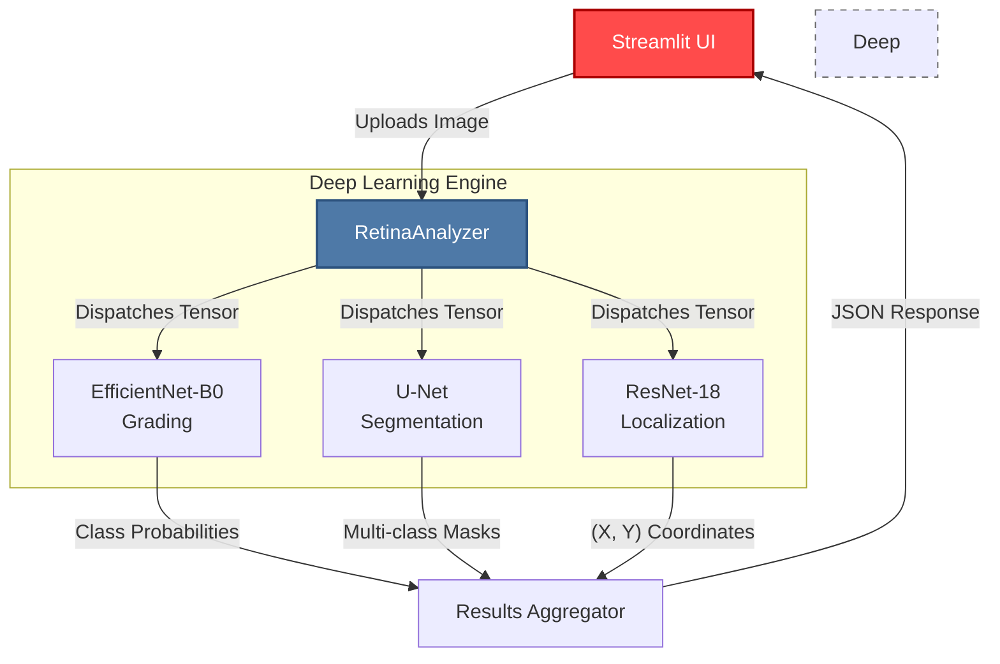
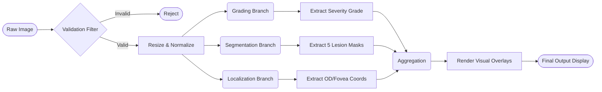
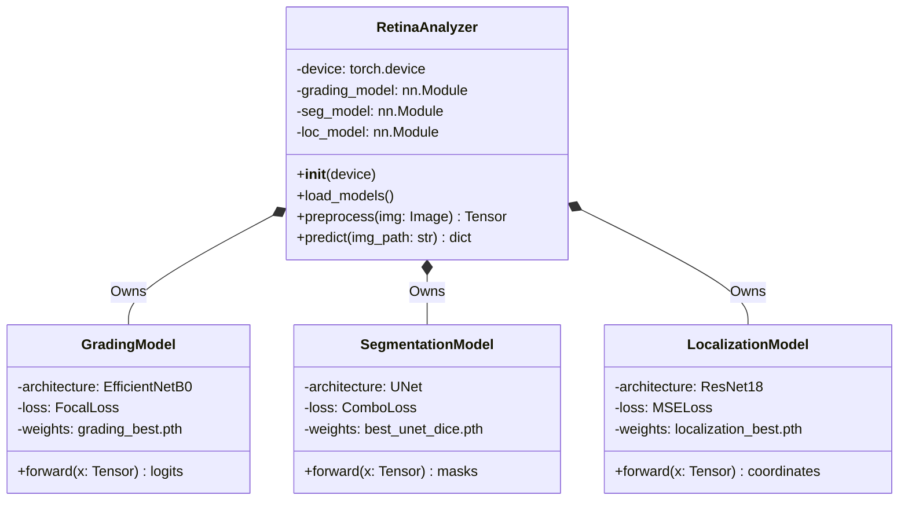
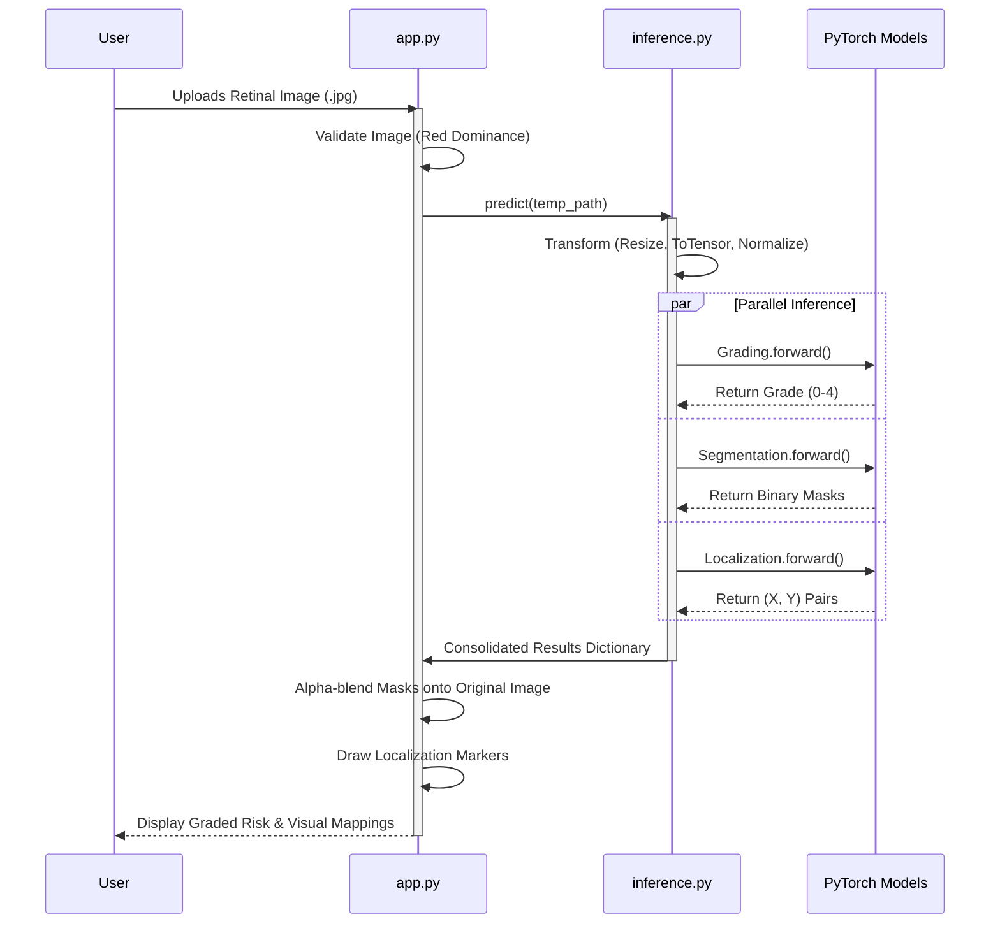

# 🏥 IDRiD: Unified Diabetic Retinopathy Analysis System

**🟢 Live Preview Available At:** [diabeticretinopathy404.streamlit.app](https://diabeticretinopathy404.streamlit.app)

This project is a comprehensive end-to-end Deep Learning diagnostic tool designed to analyze high-resolution retinal fundus images. Built upon the **Indian Diabetic Retinopathy Image Dataset (IDRiD)**, it addresses three distinct diagnostic challenges: Disease Severity Grading, Pixel-Level Lesion Segmentation, and Key Feature Localization.

---

## 🏗️ System Architecture

The overarching system architecture decouples the frontend UI from the deep learning inference engine. It uses a centralized `RetinaAnalyzer` to dispatch image tensors to three independent architectural pathways.

---

## 🔄 Inference Pipeline

The data pipeline maps the journey of a fundus image from raw user upload through multi-stage preprocessing into concurrent model evaluation, and finally to visual composition.

---

## 🧩 UML Class Diagram

The object-oriented structure of the backend relies on specific wrapper classes mapping to individual PyTorch neural networks optimized for IDRiD subsets.

---

## ⏱️ Evaluation Sequence Diagram

This sequence diagram illustrates chronological interactions during a single analysis request on the web platform, demonstrating asynchronous and parallel computation boundaries.

---

## 📋 Project Status

The project currently achieves **>95% accuracy** on Disease Severity Grading (ICDR Scale) and successfully draws high-precision pixel masks for Microaneurysms, Hard/Soft Exudates, and Haemorrhages. All required models are completely operational and accessible via the `app.py` Streamlit entrypoint.

*Documentation visually generated for isolated remote push.*
