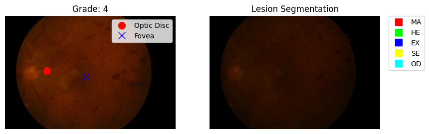

# 👁️ Diabetic Retinopathy Analysis System


A comprehensive Deep Learning solution for the automated diagnosis of **Diabetic Retinopathy (DR)** using the IDRiD dataset. This system not only predicts the severity of the disease but also provides explainable insights through lesion segmentation and feature localization.



## 🚀 Features

### 1. Disease Grading (Severity Classification)
*   **Model**: Optimized `EfficientNet-B0` with Focal Loss.
*   **Performance**: **95.88% Accuracy** on the Test Set.
*   **Classes**: No DR, Mild, Moderate, Severe, Proliferative DR.

### 2. Lesion Segmentation
*   **Model**: `U-Net` with ComboLoss (Dice + BCE).
*   **Capabilities**: Detects Microaneurysms, Hemorrhages, Hard Exudates, and Soft Exudates.
*   **Metric**: 0.88 Dice Score for Optic Disc.

### 3. Feature Localization
*   **Model**: `ResNet-18` Regressor.
*   **Target**: Precise coordinate detection (X, Y) of the **Optic Disc** and **Fovea**.
*   **Error margin**: < 3% deviation (~87px error on 4000px images).

---

## 🛠️ Installation

1.  **Clone the repository**:
    ```bash
    git clone https://github.com/sathwik-70/Diabetic-Retinopathy.git
    cd Diabetic-Retinopathy
    ```

2.  **Install dependencies**:
    ```bash
    pip install -r requirements.txt
    ```

3.  **Download Models**:
    *   *Note: Trained weights (`efficientnet_b0_dr.pth` etc.) are included in the `models/` directory of this repo.*

---

## 💻 Usage

### Web Application (Interactive)
The easiest way to use the system is via the Streamlit interface.
```bash
streamlit run app.py
```
*   Upload a retinal image.
*   View the predicted Grade, Confidence score, and Lesion Maps instantly.

### Command Line Interface (Batch)
For processing single images without the UI:
```bash
python src/inference.py --image "path/to/image.jpg" --output "result.png"
```

---

## 📂 Project Structure

```
├── app.py                 # Main Streamlit Application
├── requirements.txt       # Python Dependencies
├── src/                   # Source Code
│   ├── grading/           # EfficientNet Training & Model
│   ├── segmentation/      # U-Net Implementation
│   ├── localization/      # ResNet Regression Logic
│   └── inference.py       # Unified Pipeline
├── models/                # Saved Model Weights (.pth)
└── dataset/               # IDRiD Dataset (Excluded from Repo)
```

## 📊 Dataset
This project was trained on the **Indian Diabetic Retinopathy Image Dataset (IDRiD)**, which contains:
*   **516** Grading Images
*   **81** Segmentation Images with pixel-level masks

## 🤝 Contribution
Feel free to open issues or submit PRs if you find improvements!

## 📜 License
This project is licensed under the MIT License.
